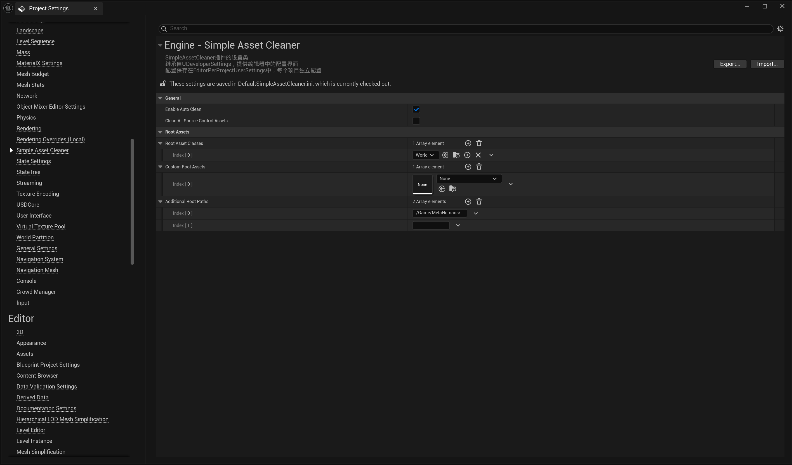
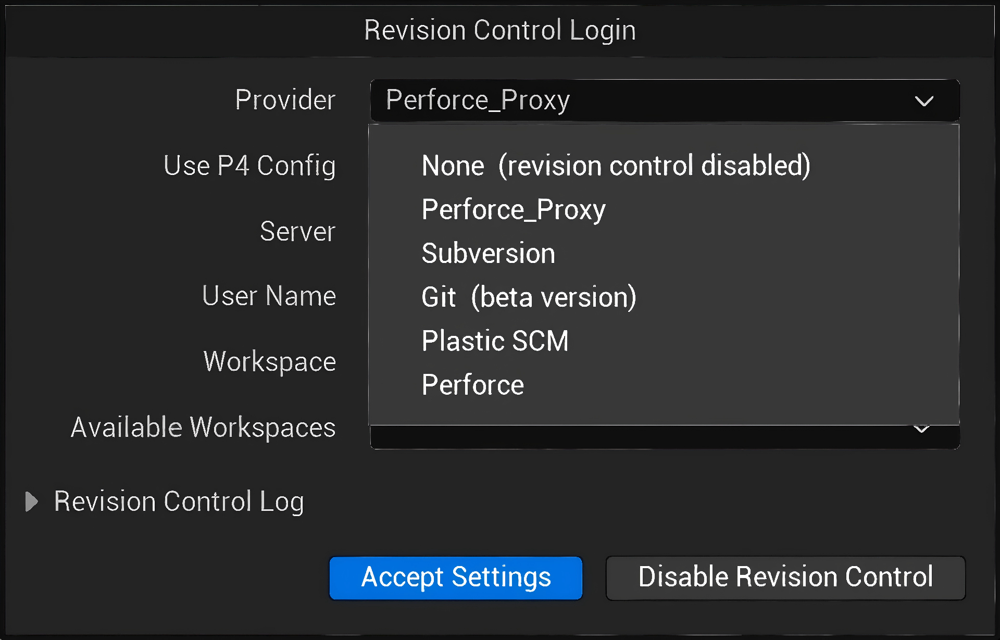

# 📘 SimpleAssetCleaner Plugin Tutorial

**SimpleAssetCleaner** automatically identifies and removes unreferenced assets from your Unreal Engine project, keeping your repository clean.

> ⚠️ **Important**: This plugin can delete assets from source control. Read carefully before use.

---

## 🎯 What Gets Cleaned

### ✅ Only Project Content
- **ONLY** assets in your project's `/Content/` folder (`/Game/` path)

### ❌ Never Touched
- Plugin assets (e.g., `/PluginName/Content/`)
- Engine assets
- Code files (C++ headers/source)
- External references outside `/Content/`

---

## 📝 How It Works

The plugin uses **reference chain analysis**:

1. **Root Assets** - Always considered "in use" (Maps, Blueprints, DataAssets, etc.)
2. **Reference Chain** - Any asset referenced by a root (directly or indirectly) is "in use"
3. **Unreferenced Assets** - Assets not reachable from any root are cleaned

### Two Modes

**Auto-Clean on Submit (Recommended)**
- Triggers when opening source control submit dialog
- Only checks newly added files
- Reverts unreferenced files from source control
- **Local copies stay safe** - never deletes from disk

**Manual Full Clean (Caution!)**
- Scans entire Content folder
- Newly added files: Reverted (local kept)
- Already tracked files: **Deleted from server AND local**

---

## ⚙️ Configuration

**Location**: Editor > Project Settings > General > Simple Asset Cleaner

### Source Control Provider (Important!)

The plugin automatically wraps your source control provider as a proxy to monitor submissions.

⚠️ **DO NOT select the proxy provider manually!**
- Always select your actual source control provider (Perforce, Git, SVN, etc.)
- The plugin automatically wraps it in the background
- Selecting the proxy directly may cause issues

**Correct Setup**:
- Use: `Perforce`, `Git`, `Subversion`, etc.
- Avoid: `Perforce_Proxy`, `Git_Proxy`, or any provider ending with `_Proxy`

### General Settings

#### Enable Auto Clean
- **Default**: ON
- **What it does**: Checks references before submission
- **Behavior**: Reverts unreferenced newly added files (local files safe)
- **Recommendation**: Keep enabled for daily use

#### Clean All Source Control Assets
- **Type**: Button
- **What it does**: Scans all Content and deletes unreferenced assets
- **WARNING**: Tracked files deleted from server AND local!
- **Recommendation**: Use only with backups and team coordination

#### Enable Verbose Logging
- **Default**: OFF
- **What it does**: Detailed logging for debugging
- **Recommendation**: Enable only when troubleshooting

### Root Asset Configuration

#### Root Asset Classes
- **Default**: `UWorld` (Map files)
- **What it does**: Assets of these types (including parent/derived classes) are treated as roots
- **Examples**:
  - `UWorld` - Maps (.umap) and derived types
  - `UDataAsset` - Data assets and derived types
- **Note**: Automatically includes parent classes and all derived classes

#### Custom Root Assets
- **What it does**: Manually specify individual assets as roots
- **Example**: `/Game/Core/GameMode.GameMode`
- **Use case**: Critical assets not covered by Root Asset Classes

#### Additional Root Paths
- **What it does**: All assets under these paths are treated as roots
- **Example**: `/Game/Essential/`, `/Game/Core/`
- **Use case**: Protect entire system folders from cleanup

---

## ⚠️ Important Notes

### What Gets Deleted vs Reverted

| Asset Status | Auto Clean | Manual Full Clean |
|-------------|-----------|------------------|
| Newly added | Reverted, **local kept** | Reverted, **local kept** |
| Already tracked | Not touched | **Deleted (server + local)** |

---

## 📬 Support

**Email**: mengzhishanghun@outlook.com

**When reporting issues include**:
- Unreal Engine version
- Source control system (Perforce/Git/SVN)
- Plugin settings screenshot
- Log output (with verbose logging enabled)

---

**Platform Support**: Tested on Windows, theoretically supports all platforms

**Remember**: Start conservative. You can always delete assets later, but recovery requires source control history!

