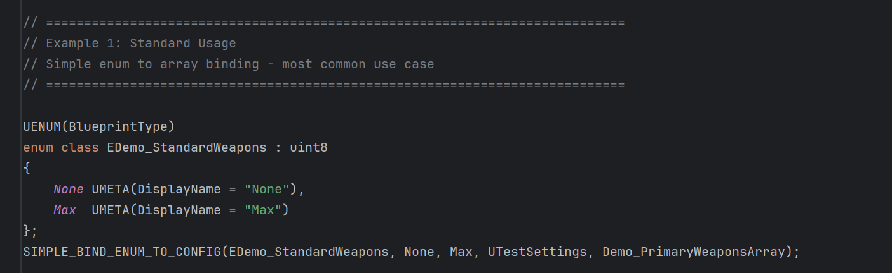
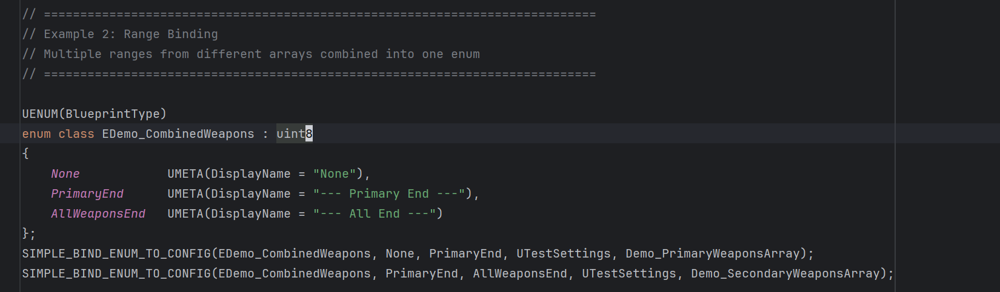
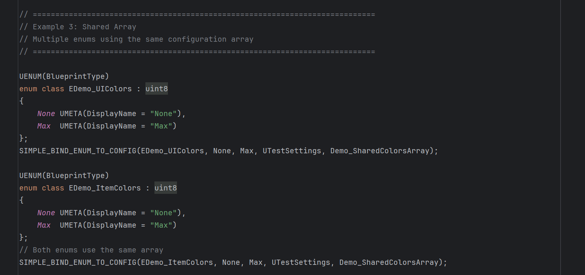
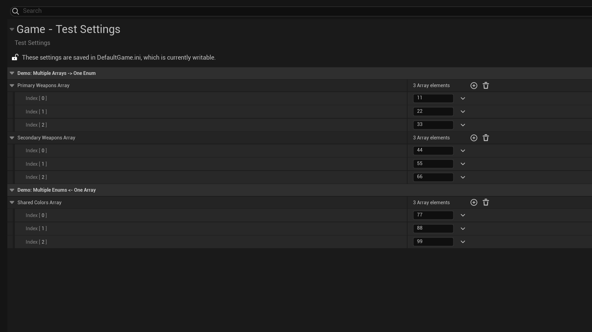
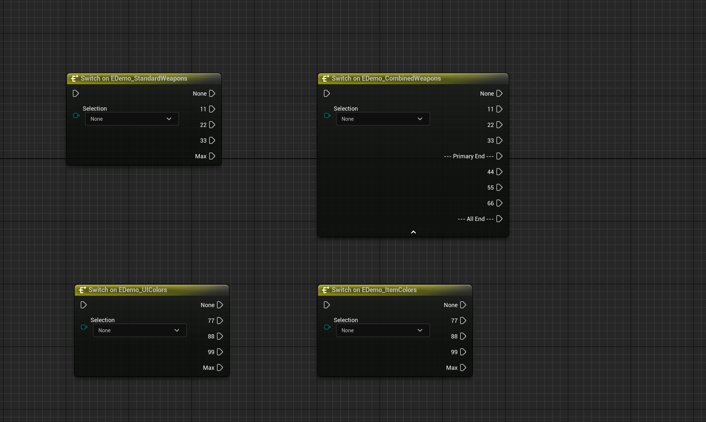

# 📘 SimpleAutoEnum Plugin Tutorial

**SimpleAutoEnum** is a lightweight plugin that automatically binds Unreal Engine enums to configurable string arrays.
Define your enum values in project settings and let the plugin dynamically populate enum entries at runtime.

> ⚠️ **Note**: This plugin requires **C++ code** to define enums and configuration arrays. It is not a pure Blueprint solution.

---

## 📝 How To Use

### SIMPLE_BIND_ENUM_TO_CONFIG Macro Parameters:

```cpp
SIMPLE_BIND_ENUM_TO_CONFIG(EnumType, MinValue, MaxValue, SettingsClass, ArrayProperty)
```

1. **EnumType**: Your enum class (e.g., `EMyWeapons`)
2. **MinValue**: Starting boundary value (e.g., `None`)
3. **MaxValue**: Ending boundary value (e.g., `Max`)
4. **SettingsClass**: Your settings class inheriting from `UDeveloperSettings`
5. **ArrayProperty**: The `TArray<FString>` property name in your settings class

### Complete Setup Process:

**Step 1: Create Settings Class**
```cpp
// MyGameSettings.h
UCLASS(config = Game, defaultconfig)
class UMyGameSettings : public UDeveloperSettings
{
    GENERATED_BODY()
public:
    UPROPERTY(config, EditAnywhere, Category = "Weapons")
    TArray<FString> WeaponsList;
};
```

**Step 2: Define Enum with Boundaries**
```cpp
// MyEnums.h
UENUM(BlueprintType)
enum class EMyWeapons : uint8
{
    None UMETA(DisplayName = "None"),
    Max  UMETA(DisplayName = "Max")
};
```

**Step 3: Bind Enum to Configuration**
```cpp
SIMPLE_BIND_ENUM_TO_CONFIG(EMyWeapons, None, Max, UMyGameSettings, WeaponsList);
```

**Step 4: Configure in Project Settings**
Go to **Project Settings > Game > Your Settings** and add string values to your arrays.

---

## 🎯 Usage Examples

### Example 1: Standard Usage
*Most common pattern - simple enum to array binding*



```cpp
UENUM(BlueprintType)
enum class EDemo_StandardWeapons : uint8
{
    None UMETA(DisplayName = "None"),
    Max  UMETA(DisplayName = "Max")
};
SIMPLE_BIND_ENUM_TO_CONFIG(EDemo_StandardWeapons, None, Max, UTestSettings, Demo_PrimaryWeaponsArray);
```

### Example 2: Range Binding
*Combine multiple arrays into one enum with different ranges*



```cpp
UENUM(BlueprintType)
enum class EDemo_CombinedWeapons : uint8
{
    None            UMETA(DisplayName = "None"),
    PrimaryEnd      UMETA(DisplayName = "--- Primary End ---"),
    AllWeaponsEnd   UMETA(DisplayName = "--- All End ---")
};
// Bind primary weapons (None -> PrimaryEnd)
SIMPLE_BIND_ENUM_TO_CONFIG(EDemo_CombinedWeapons, None, PrimaryEnd, UTestSettings, Demo_PrimaryWeaponsArray);
// Bind secondary weapons (PrimaryEnd -> AllWeaponsEnd)
SIMPLE_BIND_ENUM_TO_CONFIG(EDemo_CombinedWeapons, PrimaryEnd, AllWeaponsEnd, UTestSettings, Demo_SecondaryWeaponsArray);
```

### Example 3: Shared Array
*Multiple enums using the same configuration array*



```cpp
UENUM(BlueprintType)
enum class EDemo_UIColors : uint8
{
    None UMETA(DisplayName = "None"),
    Max  UMETA(DisplayName = "Max")
};
SIMPLE_BIND_ENUM_TO_CONFIG(EDemo_UIColors, None, Max, UTestSettings, Demo_SharedColorsArray);

UENUM(BlueprintType)
enum class EDemo_ItemColors : uint8
{
    None UMETA(DisplayName = "None"),
    Max  UMETA(DisplayName = "Max")
};
// Both enums use the same configuration array
SIMPLE_BIND_ENUM_TO_CONFIG(EDemo_ItemColors, None, Max, UTestSettings, Demo_SharedColorsArray);
```

---

## ⚙️ Configuration & Runtime Result

**Project Settings Configuration:**


**Final Runtime Result:**


The plugin dynamically generates enum values based on your configuration, making it easy to:
- Add new enum values without code changes
- Maintain consistent naming across different systems
- Share configuration between multiple enums

---

## ⚠️ Important Notes & Limitations

### Blueprint Functions
- **Issue**: Blueprint functions store enum values as `FString`, so changes to enum names or positions may not update automatically
- **Solution**: Right-click the Blueprint function and select **Refresh** to sync with current enum values

### Data Assets
- **Behavior**: Data Assets use enum indices and automatically sync when names change
- **Warning**: Reordering enum values will cause Data Asset values to shift (e.g., if you swap positions 1 and 2, a Data Asset storing value 1 will now reference position 2)
- **Recommendation**: Avoid reordering existing enum entries in production; only append new values

---

## 📬 Contact

For technical support or custom features:
📧 **mengzhishanghun@outlook.com**
