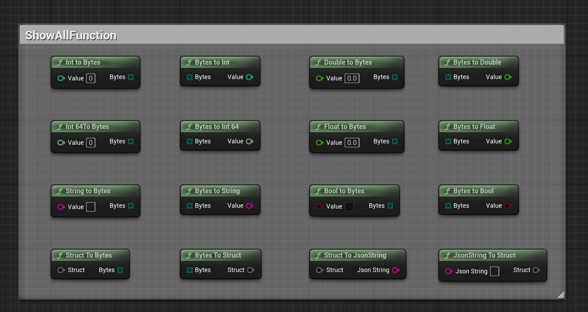
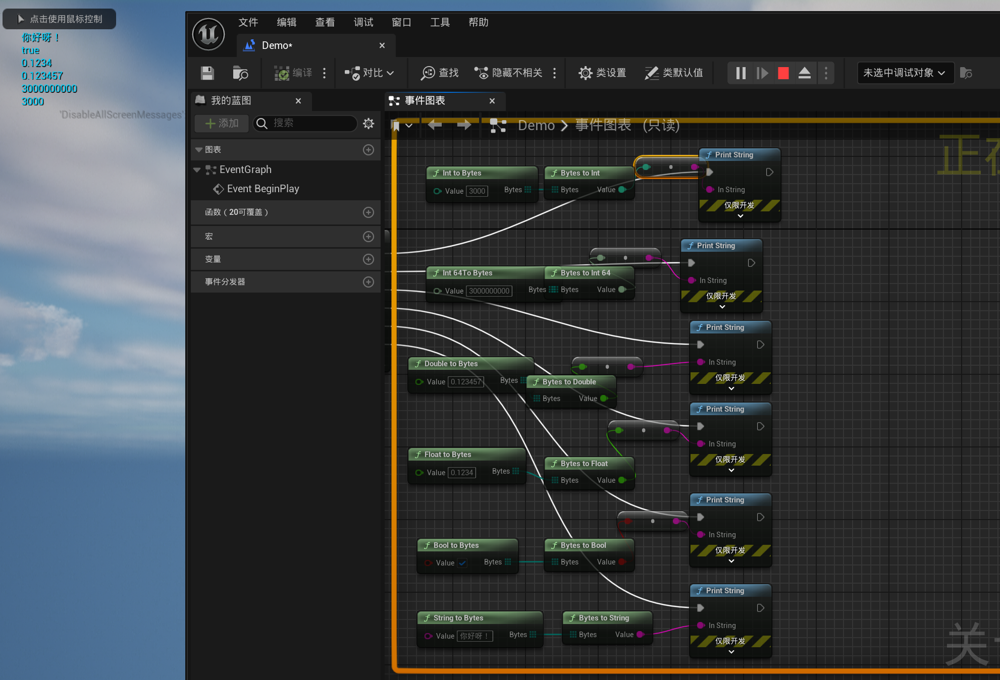
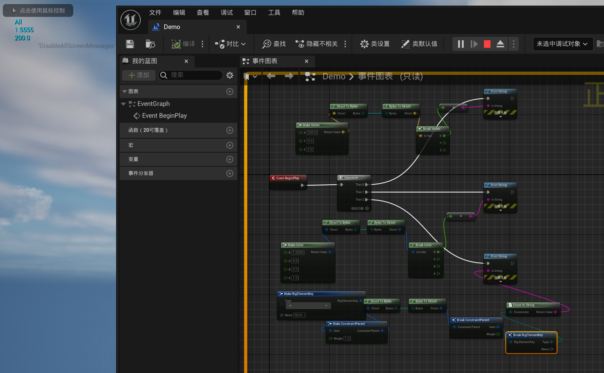
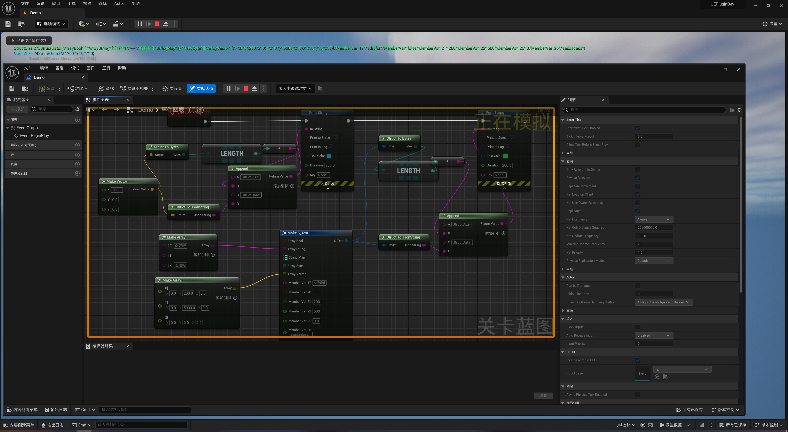

# 📘 SimpleByteConversion Plugin Tutorial (Blueprint Edition)

**SimpleByteConversion** is a lightweight plugin designed for byte-level data conversion within Unreal Engine's Blueprint system.  
It supports **bidirectional conversion between native types and structs (Bytes / Json)**, with all features exposed as Blueprint nodes.

---

## 🔧 Plugin Initialization

The plugin is automatically active after being enabled.  
All functionality is accessible through Blueprint nodes, with no need to manage Subsystems or plugin lifecycle.

---

## 🔣 Supported Type Conversions

### 📦 Native Types ↔ ByteArray

| Type         | Conversion Support |
|--------------|--------------------|
| `int32`      | To / From Bytes    |
| `int64`      | To / From Bytes    |
| `float`      | To / From Bytes    |
| `double`     | To / From Bytes    |
| `bool`       | To / From Bytes    |
| `FString`    | To / From Bytes (UTF-8 encoded)

These functions are ideal for custom protocols, lightweight storage, or binary communication.

### Blueprint Example:

(Insert image: BasicTypeConversion.jpg)

---

## 🧱 Struct ↔ ByteArray / JsonString

The plugin supports any `USTRUCT` exposed to Blueprint:

- Convert to and from byte arrays: `Struct To Bytes` / `Bytes To Struct`
- Convert to and from JSON strings: `Struct To JsonString` / `JsonString To Struct`

This functionality uses Unreal's reflection system to automatically serialize and deserialize fields, while retaining original naming and float precision.

> ⚠️ Unsupported: Structs that contain object references such as `UObject*`, `TSoftObjectPtr`, `TWeakObjectPtr`, or resource handles like `FSoftObjectPath`.

### JSON Conversion Advantages:

| Feature              | SimpleByteConversion                | UE Native FJsonObjectConverter |
|----------------------|-------------------------------------|-------------------------------|
| Field Name Preservation | ✅ Yes                            | ❌ Converts to camelCase       |
| Float/Double Precision | ✅ float(9 digits), double(17 digits) | ❌ Lower default precision     |
| Full Blueprint Support  | ✅ Yes                            | ⚠️ Partial / C++ required      |

---

## 🧪 Blueprint Node Overview (Images)

- All nodes are `BlueprintPure` — no execution pins required
- Easily composable for use in networking, file save/load, or custom protocols

---

### Blueprint Examples:

---

## ✅ Tips

- `StringToBytes` and `BytesToString` use UTF-8 encoding for safe cross-platform conversion
- Combine `StructToBytes` and `StructToJsonString` for debugging and network messaging

---

## 🔧 Recommended Companion Plugins

Works great with **SimpleTCPClient** and **SimpleUDP** plugins  
Use them together to send structured messages via TCP/UDP and decode them easily.

---

## 📬 Contact

For custom features or technical support:  
📧 **mengzhishanghun@outlook.com**

