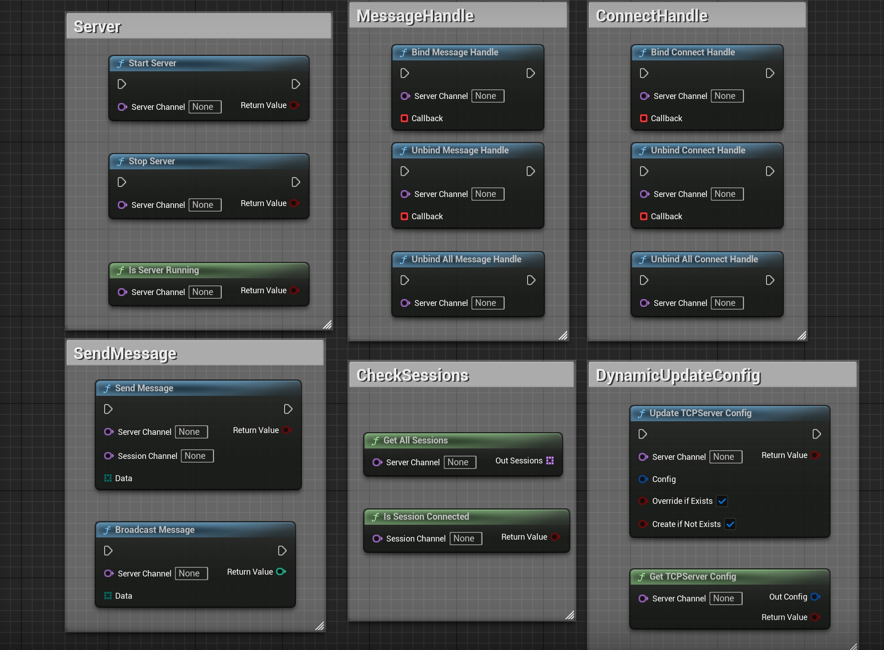

# 📘 SimpleTCPServer Plugin Tutorial (Blueprint Edition)

**SimpleTCPServer** is a lightweight TCP server plugin designed for Unreal Engine.  
It supports **multi-channel listening**, **dynamic configuration updates**, and offers a fully Blueprint-exposed API for managing client connections at runtime.

---

## 🔧 Plugin Initialization

Once enabled, the plugin activates automatically.  
It registers as a `GameInstanceSubsystem`, and its lifecycle persists across level transitions.

---

## ⚙️ Static Channel Configuration (Optional)

You can define server listening channels via **Project Settings → SimpleTCPServer Settings**.  
Using this method is recommended for centralized management and ease of debugging.

### 🔹 Channel Config Fields

| Field Name            | Example           | Description                                     |
|-----------------------|-------------------|-------------------------------------------------|
| Channel Name          | `MainServer`      | The name used in Blueprints to refer to channel|
| Bind Address (IP:Port)| `0.0.0.0:8888`     | Address to bind the listening socket           |
| Max Connections       | `32`              | Max number of concurrent client connections    |
| Max Receive Bytes     | `1024`            | Max buffer size for each message               |

---

## 🧠 Blueprint Node Interface

### 📥 Receiving

| Node Function             | Description                                |
|---------------------------|--------------------------------------------|
| `BindMessageHandle`       | Bind message receive delegate              |
| `UnbindMessageHandle`     | Unbind a specific delegate                 |
| `UnbindAllMessageHandle`  | Unbind all delegates                       |

### 🔌 Connection Status Callback

| Node Function              | Description                                      |
|----------------------------|--------------------------------------------------|
| `BindConnectHandle`        | Bind delegate for client connect/disconnect     |
| `UnbindConnectHandle`      | Unbind a specific connection delegate           |
| `UnbindAllConnectHandle`   | Unbind all connection delegates                 |

### 📤 Sending

| Node Function        | Description                                      |
|----------------------|--------------------------------------------------|
| `SendMessage`        | Send byte array to a specific SessionChannel     |
| `BroadcastMessage`   | Send byte array to all connections on a channel  |

### ⚙️ Channel & Connection Management

| Node Function             | Description                                               |
|---------------------------|-----------------------------------------------------------|
| `StartServer`             | Start listening on a server channel                       |
| `StopServer`              | Stop listening and disconnect all clients on the channel  |
| `IsServerRunning`         | Check if a server channel is running                      |
| `GetAllSessions`          | Get all current SessionChannels on a listening channel    |
| `IsSessionConnected`      | Check if a session is still connected                     |
| `UpdateTCPServerConfig`   | Update channel config (hot reload supported)              |
| `GetTCPServerConfig`      | Get current config of a channel                           |

---

## 🔁 Socket Lifecycle

| Type            | Created When                      | Destroyed When                                  |
|------------------|-----------------------------------|--------------------------------------------------|
| Listening Socket | When calling `StartServer`        | When calling `StopServer`                        |
| Session Socket   | When a client is accepted         | When client disconnects or socket is destroyed   |

---

## 🧪 Blueprint Example (Images)

### All Node Overview  

---

## ✅ Notes & Tips

- Only IPv4 is supported — domain name, IPv6, and encryption are not supported  
- All sockets are internally managed, no manual cleanup required  
- Plugin persists across level transitions, bound to GameInstance lifecycle  
- Each connected client is assigned a unique `SessionChannel` in format `"IP:Port"`

---

## 🔧 Recommended Companion Plugins

- 🔌 **SimpleTCPClient Plugin**  
  Lightweight plugin designed for client-side usage, ideal for connecting to a SimpleTCPServer instance.

- 🧩 **SimpleByteConverter Plugin**  
  Enables conversion between native Unreal types (e.g., FString, float, int) and `TArray<uint8>`, ideal for building structured protocols.

---

## 📬 Contact

Need custom features or technical support?  
📧 **mengzhishanghun@outlook.com**

