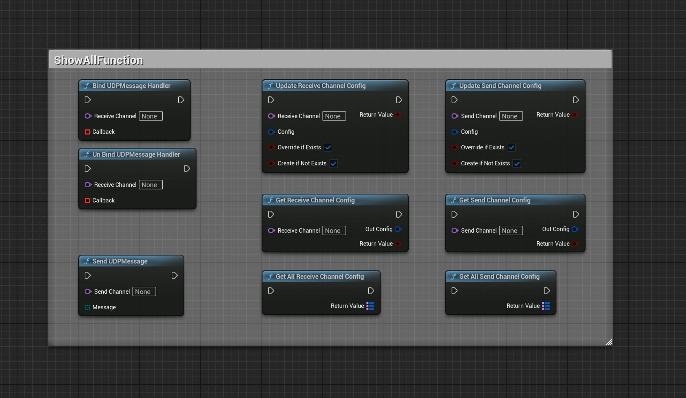
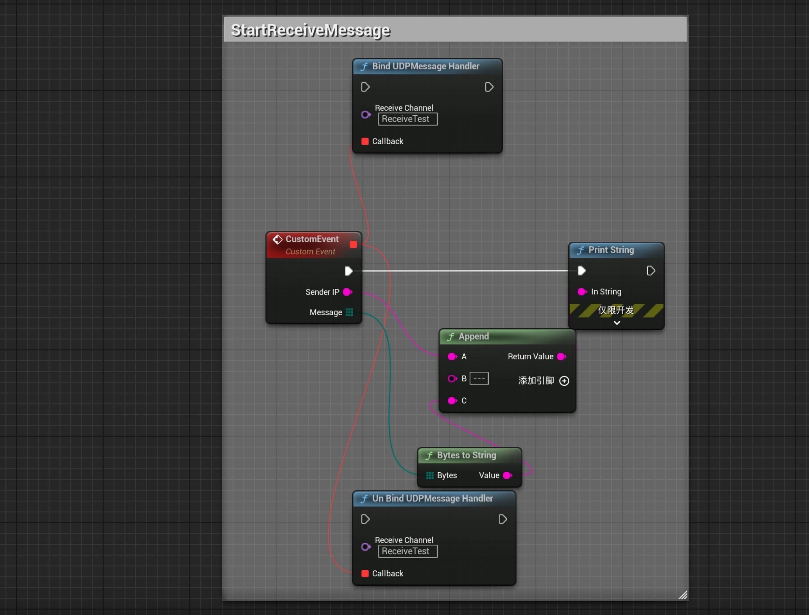
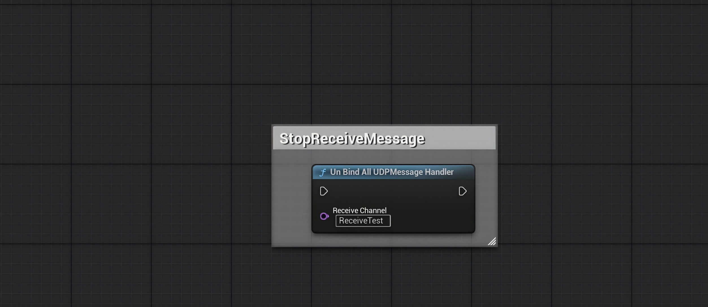
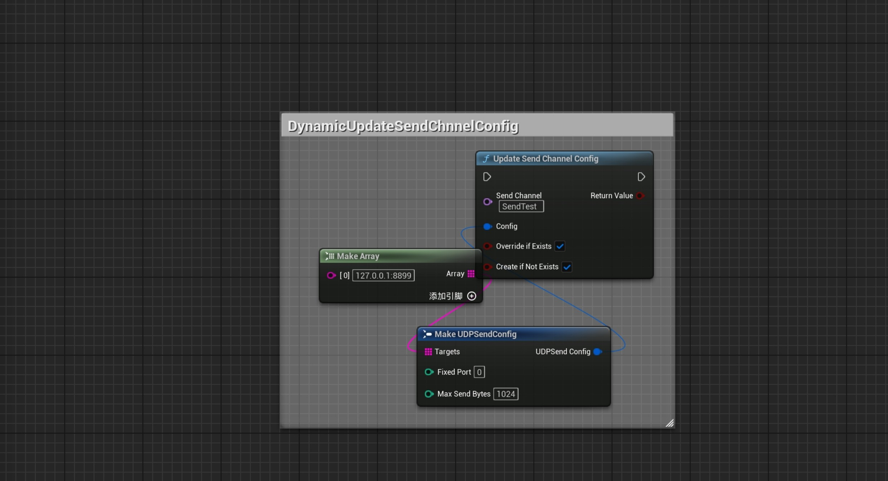
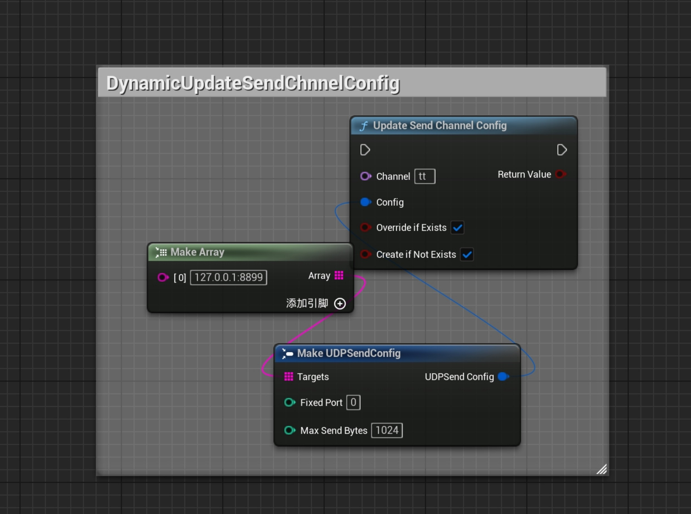
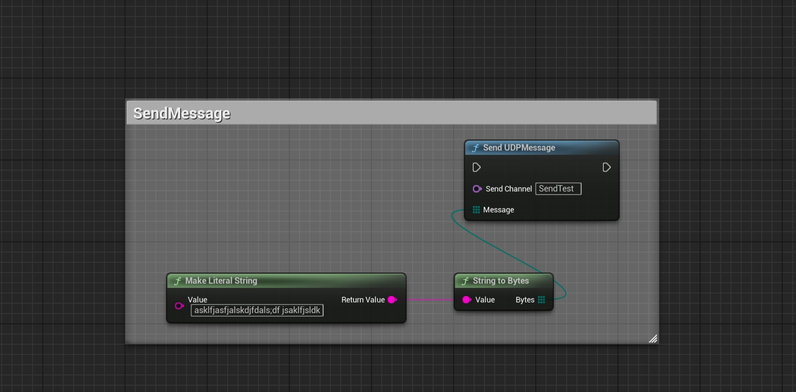

# 📘 SimpleUDP Plugin Tutorial (Blueprint Edition, English)

**SimpleUDP** is a lightweight UDP communication plugin for Unreal Engine.  
It supports **runtime dynamic configuration of send/receive channels**, and all functionality is exposed to Blueprint for easy integration.

---

## 🔧 Plugin Initialization

The plugin takes effect immediately after enabling.  
It registers internally as a `GameInstanceSubsystem` — no manual startup or shutdown code required.

---

## ⚙️ Static Channel Configuration (Optional)

You can pre-configure channels via **Project Settings → SimpleUDP Settings**.

Note: While runtime channel modification is supported, it's recommended to configure channels here whenever possible for better manageability.

### 🔹 Receive Channels

| Field             | Example             | Description                              |
|------------------|---------------------|------------------------------------------|
| Channel Name      | `DefaultRecv`       | Channel name used in Blueprint           |
| Bind Address      | `0.0.0.0:9000`      | Local IP and port to listen on           |
| Max Receive Bytes | `1024`              | Max packet size per receive              |
| Filter Mode       | None / Whitelist / Blacklist | IP filtering mode               |
| Whitelist / Blacklist | `["192.168.1.0/24"]` | Supports CIDR format              |

### 🔹 Send Channels

| Field             | Example                         | Description                              |
|------------------|----------------------------------|------------------------------------------|
| Channel Name      | `DefaultSend`                   | Channel name                             |
| Target Addresses  | `["255.255.255.255:9000"]`       | List of destination IP:Port              |
| Fixed Port 🔧     | `0` (default)                    | Local bind port for sending socket (0 = auto) |
| Max Send Bytes    | `1024`                           | Max size per packet                      |

---

## 🧠 Blueprint Node Interface

### 📥 Receiving

| Node                         | Description                             |
|------------------------------|-----------------------------------------|
| `BindUDPMessageHandler`      | Bind a message receive callback         |
| `UnBindUDPMessageHandler`    | Unbind a specific handler               |
| `UnBindAllUDPMessageHandler` | Unbind all handlers and close socket    |

### 📤 Sending

| Node              | Description                             |
|-------------------|-----------------------------------------|
| `SendUDPMessage`  | Send a byte array through the channel (socket auto-created) |

### ⚙️ Runtime Configuration

| Node                         | Description                                          |
|------------------------------|------------------------------------------------------|
| `UpdateReceiveChannelConfig` | Create/update a receive channel (rebinding if needed) |
| `UpdateSendChannelConfig`    | Create/update a send channel, supports `FixedPort` ✅  |
| `GetReceiveChannelConfig`    | Get one receive channel config                      |
| `GetSendChannelConfig`       | Get one send channel config                         |
| `GetAllReceiveChannelConfig` | Get all receive channel configs                     |
| `GetAllSendChannelConfig`    | Get all send channel configs                        |

### 🛠️ Utility Nodes

| Node             | Description                                |
|------------------|--------------------------------------------|
| `ParseEndpoint`  | Parse `"127.0.0.1:9000"` to IP and port     |
| `IsIPInCIDR`     | Check if an IP is in a CIDR block          |

---

## 🔁 Socket Lifecycle

| Type     | Created When                              | Destroyed When                             |
|----------|--------------------------------------------|--------------------------------------------|
| Receiver | First call to `BindUDPMessageHandler`      | All handlers removed → auto close socket   |
| Sender   | First call to `SendUDPMessage` or config   | Plugin shutdown or channel deleted         |

---

## 🧪 Blueprint Examples (Images)

### All Blueprint Functions  

### Bind & Unbind Example  

Socket is created automatically after the first bind, and destroyed when no more handlers remain.

### Unbind All (Force Close Socket)  

Use this node to unbind everything from a channel and close the socket manually.

### Dynamically Update Receive Channel 

Socket is auto-rebuilt if needed. Function order doesn't matter.  

The two booleans control whether to override existing channels or add new ones.

### Dynamically Update Send Channel  

Send sockets only rebuild if `FixedPort` is different.  

The two booleans behave the same as receive config.

### Send String Message  

---

## ✅ Tips & Notes

- Only IPv4 is supported (no IPv6 or domain resolution)
- Valid port range: `0~65535`, where `0` means auto-assign
- Do not bind the same port in different channels unless the socket is released
- IP filters support CIDR format (e.g. `192.168.1.0/24`)

---

## 🔧 Recommended Companion

Use with **SimpleByteConverter** plugin to easily serialize/deserialize between data ↔ `TArray<uint8>`.

---

## 📬 Contact

Need custom features or help?  
📧 **mengzhishanghun@outlook.com**

