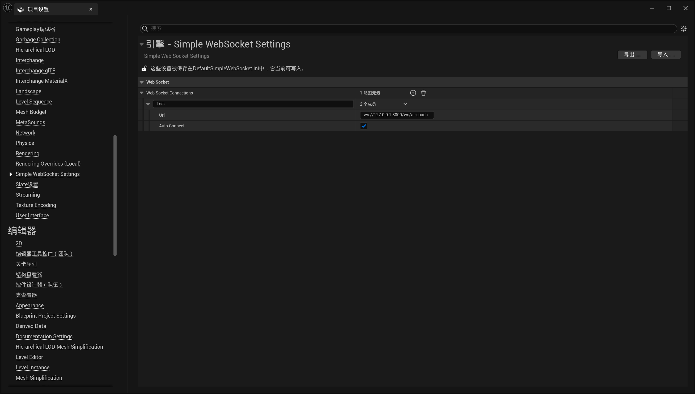
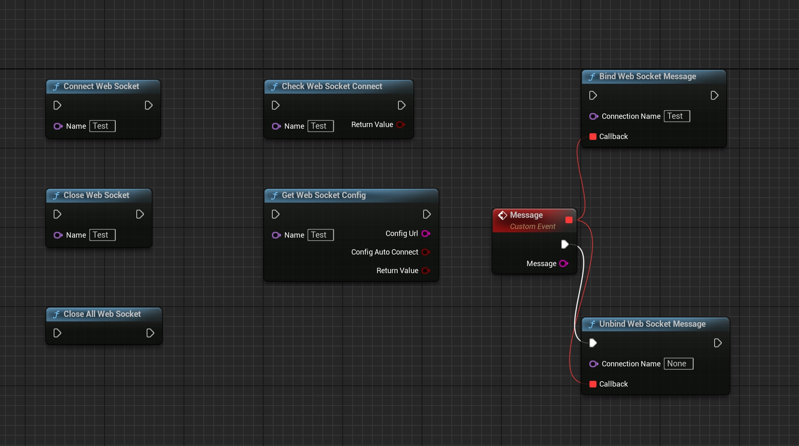

# 📘 SimpleWebSocket User Guide

This guide walks you through how to configure and use the SimpleWebSocket plugin to communicate via WebSocket in your Unreal Engine project.

---

## 🛠️ Plugin Settings

After enabling the plugin, go to the project settings panel under `Simple WebSocket Settings`.

### Steps:

1. Open Unreal Engine Editor  
2. Go to `Edit > Project Settings`  
3. Scroll down and find `Simple WebSocket Settings`  
4. Add a new WebSocket connection entry (e.g., named `Test`)  
5. Enter the WebSocket address (recommended format: `ws://127.0.0.1:xxxx`, **do not use localhost**)  
6. Enable **Auto Connect** (optional; if enabled, the connection will be established automatically at runtime)

📷 Example screenshot:

---

## 🎮 Blueprint Usage Example

You can use GameInstance-level Blueprint functions to connect, send, receive, and close WebSocket connections. All functions are static and can be called from any Blueprint.

### Available Nodes:

- `Connect Web Socket`: Connect to a WebSocket by name  
- `Send WebSocket Message`: Send a text message  
- `Bind Web Socket Message`: Bind a Blueprint event to receive messages (supports multiple callbacks)  
- `Close Web Socket`: Close a specific connection  
- `Close All Web Socket`: Close all connections  
- `Check Web Socket Connect`: Check if a connection is established  
- `Get Web Socket Config`: Retrieve config for a named connection  
- `Unbind Web Socket Message`: Unbind a message event  

📷 Example Blueprint graph:

---

## ✅ Notes

- The plugin only supports the `ws://` protocol. Secure `wss://` is **not** supported.
- Fully tested in **packaged builds** — works as expected in production.
- Avoid using `localhost` in WebSocket URLs. Always use `127.0.0.1` instead to prevent connection issues.
- Each connection name can have multiple bound callbacks, allowing modular event handling.

---

## 📮 Contact

For questions, support, or licensing inquiries, contact:  
**mengzhishanghun@outlook.com**

